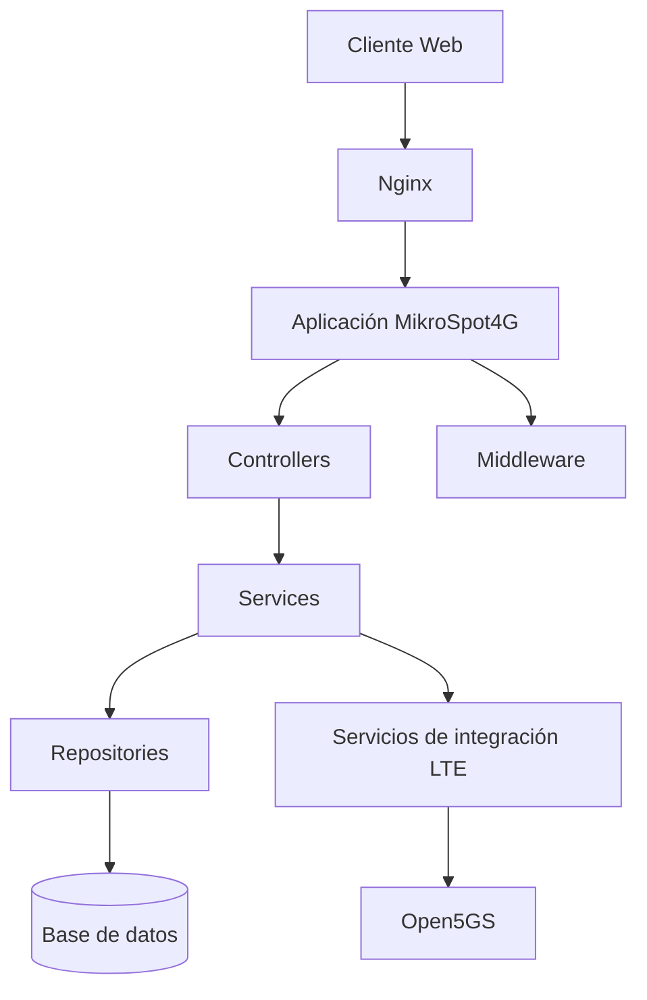
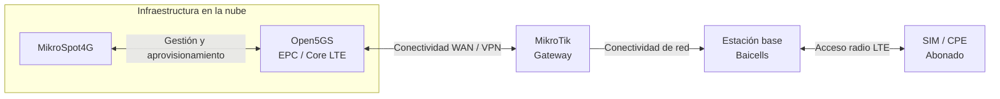
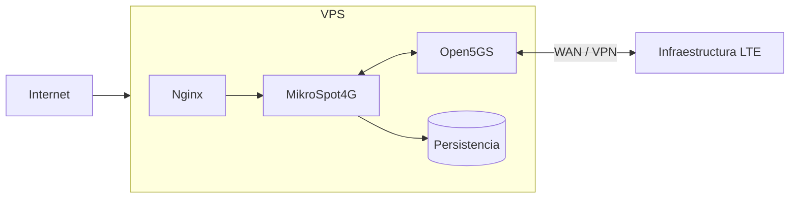

# MikroSpot4G

**Plataforma de gestión, comercialización y aprovisionamiento de servicios LTE.**

MikroSpot4G es una plataforma web desarrollada para apoyar la administración y comercialización de servicios de conectividad sobre una infraestructura LTE privada.

El sistema centraliza procesos relacionados con clientes, vendedores, tarjetas SIM, zonas de operación, paquetes de datos, saldos y ventas, y los relaciona con procesos técnicos de aprovisionamiento mediante una integración con **Open5GS**.

> **Caso de estudio técnico de un proyecto privado.**
>
> Este repositorio documenta de manera general la arquitectura, funcionalidades, decisiones técnicas y experiencia de implementación de MikroSpot4G.
>
> El código fuente, credenciales, configuraciones reales de infraestructura, direcciones IP, parámetros de red, información de abonados y demás información sensible o propietaria no forman parte de este repositorio público.

---

## Contexto del proyecto

La operación de una red LTE privada requiere coordinar dos áreas que normalmente manejan responsabilidades diferentes.

Por una parte se encuentra la **gestión comercial**, que comprende elementos como:

- Clientes.
- Vendedores.
- Tarjetas SIM.
- Paquetes de servicio.
- Saldos.
- Ventas.
- Vigencia de los servicios.

Por otra parte se encuentra la **infraestructura LTE**, responsable de aspectos como:

- Identificación de abonados.
- Aprovisionamiento.
- Autenticación.
- Sesiones de datos.
- Políticas del servicio.
- Límites de consumo.
- Acceso a la red LTE.

MikroSpot4G fue desarrollado para relacionar estos dos dominios mediante una única plataforma de gestión.

La aplicación permite que una operación comercial, como la venta de un paquete LTE a un cliente, pueda posteriormente traducirse en las acciones técnicas necesarias para proporcionar el servicio sobre la infraestructura de telecomunicaciones.

---

## Problema abordado

La administración comercial y la infraestructura de telecomunicaciones pertenecen a dominios distintos.

Una venta puede contener información como:

| Dominio comercial | Dominio LTE |
|---|---|
| Cliente | Abonado |
| Tarjeta SIM | Identidad del abonado |
| Paquete contratado | Perfil del servicio |
| Vigencia | Condiciones de activación |
| Límite de datos | Política de consumo |
| Estado de la venta | Estado técnico del servicio |

El reto consiste en mantener ambos dominios separados, pero permitir que puedan relacionarse de forma controlada.

MikroSpot4G actúa como una **capa de gestión entre la operación comercial y el aprovisionamiento del servicio LTE**.

---

## Solución propuesta

La plataforma centraliza la operación administrativa y utiliza servicios especializados para comunicarse con Open5GS.

El funcionamiento general se divide en tres áreas:

| Gestión comercial | Integración | Infraestructura LTE |
|---|---|---|
| Usuarios y roles | Servicios de aprovisionamiento | Open5GS |
| Clientes | Sincronización | Núcleo LTE |
| Vendedores | Activación de servicios | Estación base |
| Tarjetas SIM | Gestión de vigencias | Acceso radio |
| Paquetes LTE | Control de límites | Abonados |
| Ventas y saldos | Estados técnicos | Conectividad |

Esta separación permite que la lógica comercial de MikroSpot4G no dependa directamente de los componentes internos de la red LTE.

---

# Funcionalidades principales

## Gestión de usuarios y roles

La plataforma contempla diferentes niveles de acceso para separar las responsabilidades dentro del sistema.

Entre los perfiles utilizados se encuentran funciones administrativas y comerciales, permitiendo controlar las operaciones disponibles para cada usuario.

La autenticación, autorización y validación de sesiones se gestionan mediante componentes específicos de la aplicación.

---

## Gestión de clientes

MikroSpot4G permite registrar y administrar los clientes que adquieren servicios LTE.

La información comercial del cliente se mantiene separada de la información técnica utilizada posteriormente por la infraestructura de telecomunicaciones.

Esto permite administrar independientemente los datos del cliente y los parámetros necesarios para proporcionar el servicio.

---

## Gestión de tarjetas SIM

Las tarjetas SIM constituyen el vínculo entre la operación comercial y el abonado que utilizará la red LTE.

Dentro de MikroSpot4G se mantiene la relación entre cuatro elementos principales:

| Elemento | Responsabilidad |
|---|---|
| **Cliente** | Titular comercial del servicio |
| **SIM** | Recurso asignado al cliente |
| **Servicio contratado** | Condiciones comerciales adquiridas |
| **Abonado LTE** | Representación técnica utilizada por la infraestructura |

Esta separación permite conservar trazabilidad sobre qué cliente posee una SIM, qué servicio tiene contratado y qué abonado técnico corresponde a esa operación.

---

## Gestión de zonas

La plataforma permite organizar parte de la operación comercial mediante zonas.

Las zonas pueden utilizarse para relacionar diferentes elementos del sistema y facilitar la administración de vendedores y la distribución de la operación.

---

## Gestión de paquetes LTE

Los administradores pueden definir paquetes que posteriormente pueden ser comercializados.

Un paquete puede representar características del servicio como:

- Vigencia.
- Capacidad de datos.
- Precio.
- Condiciones comerciales.
- Parámetros asociados al servicio.

La definición comercial permanece separada de los mecanismos utilizados posteriormente para aplicar esas condiciones sobre la infraestructura LTE.

---

## Gestión de saldos

MikroSpot4G contempla la administración de saldos asociados a la operación comercial.

Esto permite controlar las operaciones realizadas por los usuarios correspondientes y mantener trazabilidad sobre los movimientos relacionados con la comercialización de servicios.

---

## Proceso de venta

La venta constituye uno de los procesos centrales de la plataforma.

En lugar de tratarla como una única operación, MikroSpot4G la divide conceptualmente en varias etapas:

| Etapa | Operación |
|---|---|
| 1 | Selección o registro del cliente |
| 2 | Selección de la tarjeta SIM |
| 3 | Selección del paquete LTE |
| 4 | Validación de las condiciones de la operación |
| 5 | Registro de la venta |
| 6 | Actualización de la información comercial |
| 7 | Preparación del aprovisionamiento |
| 8 | Interacción con Open5GS |
| 9 | Actualización del estado técnico |

Esta separación es importante porque el registro comercial y la operación sobre la infraestructura LTE no representan exactamente la misma transacción.

Una venta puede quedar registrada incluso cuando posteriormente sea necesario diagnosticar, reintentar o verificar una operación técnica.

---

# Integración con Open5GS

Open5GS constituye uno de los componentes principales de la infraestructura LTE utilizada por el proyecto.

MikroSpot4G incorpora una capa de servicios especializada para relacionar las operaciones de negocio con la información técnica necesaria para administrar los abonados.

Entre los procesos relacionados con esta integración se encuentran:

- Aprovisionamiento de abonados.
- Sincronización de información.
- Activación de servicios.
- Gestión de vigencias.
- Aplicación de límites de datos.
- Actualización de parámetros asociados al servicio.
- Consulta y control de estados técnicos.

La integración se mantiene separada de la lógica comercial mediante servicios y repositorios especializados.

De esta manera, la aplicación no necesita incorporar dentro de sus módulos comerciales los detalles específicos de funcionamiento del núcleo LTE.

---

# Ciclo de vida del servicio

MikroSpot4G no limita su funcionamiento al momento de realizar una venta.

El sistema contempla diferentes estados durante la vida de un servicio:

| Estado | Descripción |
|---|---|
| **Venta** | Se registra comercialmente la contratación |
| **Aprovisionamiento** | Se prepara la información técnica correspondiente |
| **Activación** | El servicio queda habilitado en la infraestructura |
| **Servicio vigente** | El abonado puede utilizar el servicio bajo las condiciones contratadas |
| **Control** | Se verifican condiciones como vigencia y consumo |
| **Expiración** | El servicio alcanza una condición de finalización |
| **Actualización técnica** | La infraestructura refleja el nuevo estado |

Esta organización permite administrar tanto condiciones temporales como límites asociados al consumo de datos.

---

# Arquitectura de la aplicación

MikroSpot4G utiliza una organización orientada a la separación de responsabilidades.

A nivel conceptual, la aplicación puede representarse de la siguiente manera:

Esta organización permite mantener la presentación, lógica de negocio, persistencia e integración LTE como responsabilidades diferenciadas.

---

## Organización lógica

El proyecto se encuentra organizado en componentes especializados.

| Componente | Responsabilidad |
|---|---|
| **Controllers** | Reciben solicitudes y coordinan las operaciones de la aplicación |
| **Middleware** | Gestiona aspectos transversales como acceso, sesiones y validaciones |
| **Services** | Contienen y coordinan la lógica de negocio |
| **Repositories** | Abstraen las operaciones de persistencia y acceso a datos |
| **Support** | Agrupa componentes auxiliares utilizados por la aplicación |
| **Views** | Contiene la presentación de la interfaz web |
| **Database** | Mantiene elementos relacionados con persistencia y estructura de datos |
| **Scripts** | Contiene procesos auxiliares y automatizaciones |
| **Infrastructure** | Agrupa componentes relacionados con despliegue y operación |

La separación de responsabilidades facilita el mantenimiento del sistema y reduce el acoplamiento entre la lógica comercial y la infraestructura LTE.

---

# Arquitectura de integración con la red LTE

La aplicación forma parte de una arquitectura más amplia que incluye infraestructura en la nube y componentes físicos de telecomunicaciones.

La implementación actual puede resumirse de la siguiente manera:

Esta arquitectura permite mantener la plataforma de administración y el núcleo LTE en infraestructura de servidor, mientras la estación base proporciona físicamente el acceso radio a los abonados.

### Responsabilidad de cada componente

| Componente | Función |
|---|---|
| **MikroSpot4G** | Administración comercial y gestión del ciclo de vida de los servicios |
| **Open5GS** | Funciones del núcleo LTE y administración técnica de abonados |
| **MikroTik** | Gateway y conectividad WAN utilizada por la infraestructura |
| **Estación base Baicells** | Acceso radio LTE |
| **SIM / CPE** | Identificación y acceso del abonado al servicio |

La configuración específica de la estación base, MikroTik, Open5GS y demás componentes de red no se publica en este repositorio.

---

# Infraestructura del servidor

La plataforma fue desplegada sobre un **VPS con Ubuntu Server 22.04 LTS**.

El VPS fue contratado con **HostDime Group / Premier Global Datacenters** y fue entregado con el sistema operativo base instalado.

A partir de ese entorno se realizó la preparación y configuración necesaria para alojar los componentes del proyecto.

Entre las tareas realizadas sobre el servidor se encuentran:

- Preparación del entorno Ubuntu Server.
- Instalación y configuración de dependencias requeridas por la plataforma.
- Configuración del servidor web.
- Configuración de Nginx.
- Preparación de los servicios de la aplicación.
- Configuración del entorno de ejecución.
- Implementación de contenedores y servicios auxiliares cuando corresponde.
- Configuración de Open5GS dentro de la infraestructura utilizada por el proyecto.
- Configuración de mecanismos necesarios para la comunicación entre la plataforma y los servicios LTE.
- Preparación de procesos auxiliares y automatizaciones.
- Gestión de variables de entorno y configuración sensible.
- Puesta en operación de los componentes necesarios para el funcionamiento de MikroSpot4G.

Las credenciales, direcciones IP, reglas específicas de firewall, configuraciones de VPN, parámetros del núcleo LTE y demás información operacional se mantienen fuera de este repositorio.

---

## Alcance de la configuración de infraestructura

Es importante diferenciar los componentes desarrollados o configurados durante el proyecto de aquellos que formaban parte previamente de la infraestructura.

### Configuración realizada como parte del proyecto

Se trabajó directamente sobre:

- VPS Ubuntu Server 22.04 LTS.
- Entorno de ejecución de MikroSpot4G.
- Servidor web y Nginx.
- Servicios necesarios para la aplicación.
- Open5GS.
- Integración entre MikroSpot4G y el núcleo LTE.
- Procesos de soporte y automatización relacionados con el servicio.

### Infraestructura física existente

La solución también utiliza componentes físicos necesarios para proporcionar el servicio LTE, entre ellos:

- Equipo MikroTik utilizado para conectividad.
- Estación base Baicells.
- Equipos/SIM utilizados por los abonados.

Estos componentes forman parte de la arquitectura general, pero su presencia en esta documentación no implica que toda su configuración original haya sido realizada durante el desarrollo de MikroSpot4G.

---

# Despliegue

La infraestructura del proyecto contempla diferentes mecanismos para facilitar la operación de los servicios.

Entre las herramientas utilizadas se encuentran:

- Ubuntu Server 22.04 LTS.
- Nginx.
- Docker.
- Docker Compose.
- Servicios del sistema operativo.
- Variables de entorno.
- Scripts de soporte.
- Tareas automatizadas.

Conceptualmente, el despliegue mantiene separados los diferentes niveles de la solución:

Los archivos reales de configuración utilizados en producción no forman parte de este repositorio público.

---

# Separación entre negocio e infraestructura

Una decisión importante del proyecto consiste en evitar que una operación comercial dependa completamente del éxito inmediato de una operación sobre la infraestructura LTE.

Conceptualmente se manejan dos responsabilidades:

### Operación comercial

Registra información relacionada con:

- Cliente.
- SIM.
- Paquete.
- Venta.
- Saldo.
- Vigencia.
- Estado interno.

### Operación técnica

Gestiona posteriormente aspectos como:

- Aprovisionamiento.
- Sincronización con Open5GS.
- Activación.
- Actualización del abonado.
- Límites del servicio.
- Estado técnico.

Esto permite conservar información sobre una operación aun cuando una acción técnica no pueda completarse inmediatamente.

De esta manera pueden implementarse mecanismos de diagnóstico, seguimiento o recuperación sin perder la trazabilidad de la operación comercial.

---

# Tecnologías utilizadas

| Área | Tecnologías / componentes |
|---|---|
| **Aplicación web** | PHP, HTML, CSS, JavaScript |
| **Servidor web** | Nginx |
| **Base de datos** | Persistencia relacional |
| **Infraestructura** | Ubuntu Server 22.04 LTS |
| **Contenedores** | Docker, Docker Compose |
| **Telecomunicaciones** | Open5GS |
| **Red** | MikroTik |
| **Acceso LTE** | Estación base Baicells |
| **Administración** | Variables de entorno, servicios y scripts de soporte |

---

# Principales retos técnicos

El desarrollo de MikroSpot4G combina problemas propios del desarrollo de software con aspectos relacionados con infraestructura y telecomunicaciones.

Entre los principales retos se encuentran:

### Integración entre dos dominios

La plataforma debe relacionar información comercial con información técnica sin acoplar completamente ambos modelos.

### Aprovisionamiento LTE

Una operación realizada desde una interfaz administrativa puede requerir posteriormente cambios sobre la información utilizada por el núcleo LTE.

### Gestión del ciclo de vida

Los servicios pueden tener vigencia y límites de consumo que requieren verificaciones posteriores a la venta.

### Trazabilidad

Las operaciones comerciales deben conservarse incluso cuando una operación técnica pueda fallar o requiera ser ejecutada nuevamente.

### Administración de infraestructura

La aplicación no funciona de manera aislada, sino que depende de servicios desplegados y configurados sobre infraestructura Linux.

### Seguridad de la información

La solución maneja información técnica y operacional que no debe almacenarse directamente en el código fuente ni publicarse en repositorios abiertos.

---

# Seguridad y protección de información

Debido a que MikroSpot4G se relaciona con infraestructura real de telecomunicaciones, este repositorio aplica una separación estricta entre documentación pública e información operacional.

No se publican:

- Credenciales.
- Contraseñas.
- Claves privadas.
- Variables de entorno reales.
- Direcciones IP privadas o públicas utilizadas en producción.
- Parámetros reales de VPN.
- Configuraciones de firewall.
- Configuración detallada del MikroTik.
- Configuración detallada de la estación base.
- Información de abonados.
- IMSI u otros identificadores reales.
- Configuración operacional de Open5GS.
- Bases de datos.
- Código fuente propietario.
- Archivos internos de infraestructura.

La documentación presentada tiene como objetivo explicar las decisiones de diseño y la experiencia técnica obtenida durante el proyecto sin exponer información sensible.

---

# Mi participación en el proyecto

Mi participación en MikroSpot4G comprende tanto actividades de desarrollo de software como de infraestructura e integración con telecomunicaciones.

Entre las responsabilidades desarrolladas se encuentran:

- Participación en el diseño y desarrollo de la plataforma MikroSpot4G.
- Implementación de funcionalidades administrativas y comerciales.
- Trabajo sobre la integración entre la plataforma y Open5GS.
- Gestión de procesos relacionados con abonados y servicios LTE.
- Preparación del servidor utilizado para alojar la solución.
- Configuración del entorno Ubuntu Server a partir del sistema operativo base proporcionado por el proveedor del VPS.
- Instalación y configuración de los servicios necesarios para la plataforma.
- Configuración de Nginx y componentes asociados al despliegue.
- Trabajo con Docker y Docker Compose.
- Configuración y operación de Open5GS dentro del entorno utilizado por el proyecto.
- Implementación y mantenimiento de procesos auxiliares y automatizaciones.
- Diagnóstico de problemas relacionados con la interacción entre software, servidor e infraestructura LTE.

La estación base Baicells fue proporcionada con una configuración inicial existente, por lo que su configuración original no se atribuye al desarrollo de MikroSpot4G.

---

# Estado del proyecto

MikroSpot4G corresponde a un proyecto privado y continúa formando parte de una infraestructura operacional.

Este repositorio funciona exclusivamente como **caso de estudio técnico y documentación de portafolio**.

Por este motivo, el código fuente y la configuración utilizada en el entorno real permanecen privados.

---

# Objetivo de este repositorio

El propósito de este repositorio es documentar experiencia práctica relacionada con:

- Desarrollo de aplicaciones web.
- Diseño de lógica de negocio.
- Arquitectura de software.
- Administración de servidores Linux.
- Despliegue de aplicaciones.
- Docker y servicios de infraestructura.
- Integración entre aplicaciones e infraestructura LTE.
- Open5GS.
- Gestión de servicios de telecomunicaciones.
- Separación entre lógica comercial e infraestructura.
- Seguridad y manejo responsable de información sensible.

La documentación busca mostrar las decisiones técnicas y el alcance del proyecto sin comprometer el código fuente ni la infraestructura real utilizada en producción.

---

## Nota

Los nombres de productos y tecnologías mencionados pertenecen a sus respectivos propietarios.

La información presentada en este repositorio ha sido simplificada deliberadamente y no representa la configuración completa de la infraestructura utilizada en el entorno real.
